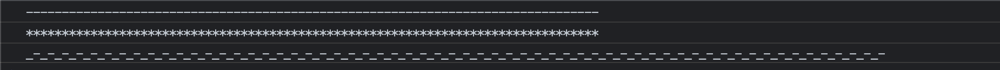

<h1 align="center">🌟 DoDollar 🌟 </h1>

<br />

<h2 align="center">Method Chaining, Lifecycle Hooks, Extended, Lightweight Output CONSOLE</h2>

<br />


## Table of Contents

- [Docs](#docs)
  - [Installation](#installation)
  - [Basic Usage](#basic-usage)
  - [Method Chaining](#method-chaining)
  - [Extended Utilities](#extended-utilities)
    - [`title` method](#title-method)
    - [`blankLine` method](#blankline-method)
    - [`start` and `end` methods](#start-and-end-methods)
    - [`fold` : integrate `start` and `end`](#fold--integrate-start-and-end)
    - [`separate`](#separate)
  - [Lifecycle Hooks](#lifecycle-hooks)
    - [Concept](#concept)
    - [Usage](#usage)
    - [Setting in batch](#setting-in-batch)
  - [Road Map](#road-map)
  - [Author](#author)
  - [License](#license)

# Docs

## Installation

1. npm

```shell
npm i dodollar
```

2. yarn

```shell
yarn add dodollar
```

3. bun

```shell
bun add dodollar
// or
bun a dodollar
```

## Basic Usage

Act like `console.log`.

```ts
import $$ from 'dodollar';

$$.log('foo');
//> foo
```

> DoDollar compatible with commonly used several methods:
>
> 1. `log`
> 2. `info`
> 3. `debug`
> 4. `warn`
> 5. `error`
> 6. `time`
> 7. `timeLog`
> 8. `timeEnd`

## Method Chaining

```ts
$$.log('foo').warn('baz').error('xyzzy');
```

Output:


## Extended Utilities

There are some extended utilities for convenience.

```ts
$$.separate().title('Debug point').blankLine().log('foo').separate();
```

Output:


### `title` method

Output a title.

```ts
$$.title('Hello DoDollar');

// Output
//> # Hello DoDollar
```

### `blankLine` method

Output blank lines. accept a number to indicate count of blank line.

### `start` and `end` methods

Same as `console.group()` and `console.groupEnd()` make the multiply output line becomes a group and you can easily collapse it:

```ts
$$.start('Start').title('Hello DoDollar').separate().end();
```

Output:


### `fold` : integrate `start` and `end`

If you just want to print a group output, you need the `start()`, `end()`, and middle method `log()` :

```ts
const data = {
  name: 'Jack',
  age: 18,
};

$$.start().log(data).end();
```


Equal to `$$.start().log(data).end()`, `fold()` help out this weary code then you can quickly create a group output:

```ts
$$.fold();
```

### `separate`

Output one line separator， dash( `-` ) as separator character and maximum number is `80` by default.

```ts
$$.separate().separate('*').separate('_-', 150);
```

Output:



## Lifecycle Hooks

### Concept

DoDollar support adding custom lifecycle hooks into one method.

Normal method invoke:


Method invoke with hooks:


You can add three types of hook:

1. `intercept`: intercept the method execution and over it if hook function return `true`.
2. `before`: execute hook function before method execution.
3. `after`: same as `before`, execute hook function after method is executed.

> `before` and `after` didn't effect-side for the method.

### Usage

With help of lifecycle hook, you can build custom console output for your page or whole project:

```ts
// myDoDollar.ts

import { DoDollar } from 'dodollar';
import $$ from 'dodollar';

const myDoDollar = new DoDollar({
  beforeLog: () => {
    $$.log('before log...');
  },
  afterError: () => {
    $$.log('Report error to server...');
  },
  interceptInfo: () => {
    $$.log('Intercept execution in production environment.');
    return true;
  },
});

export default myDoDollar;
```

Deliver custom hooks into `DoDollar` constructor.
Import your custom dodollar:

```ts
import $$ from './myDodollar';

$$.log('I own beforeLog()')
  .blankLine()
  .error('I own afterError()')
  .blankLine()
  .info("I own interceptInfo() and you can't see me.");
```


### Setting in batch

DoDollar support to setting lifecycle hooks in batch by config `batchIntercept`, `batchBefore`, and `batchAfter`:


## Road Map

The list below should give some indication of my plans for the next major release, and for the future.

- [x] Setting hook in batches according to different environment.
- [ ] Chinese version docs.
- [ ] Print complex data structure entirely.
- [ ] Add batch hooks user docs.
- [ ] `fold` : same as $$.start().log().end()

## Author

| [](https://github.com/Penggeor) |
| :-------------------------------------------------------------------------------------------: |
|                             [Pandy](https://github.com/Penggeor)                              |

## License

MIT © [Pandy](https://avatars.githubusercontent.com/u/68799055?v=4)
